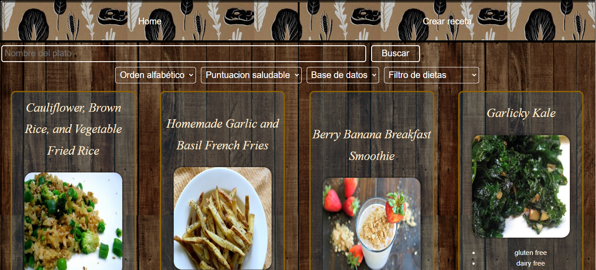
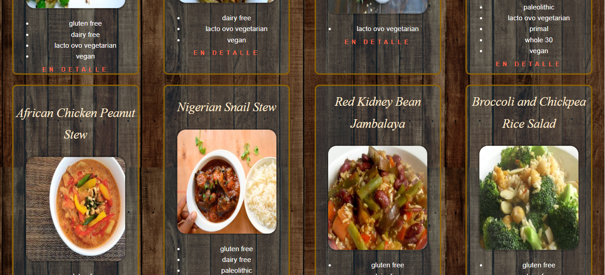
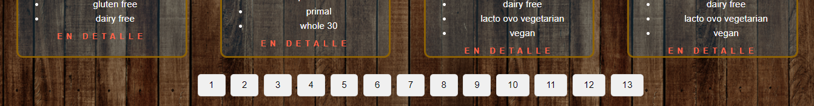
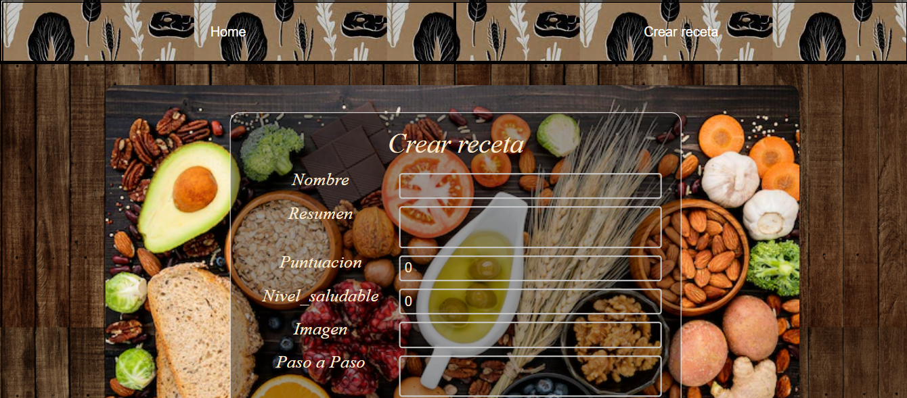
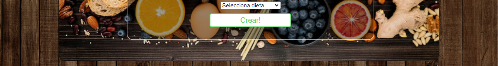
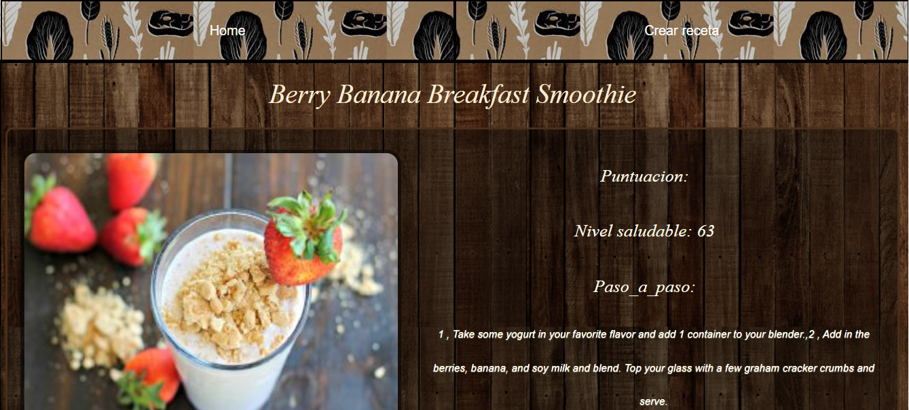
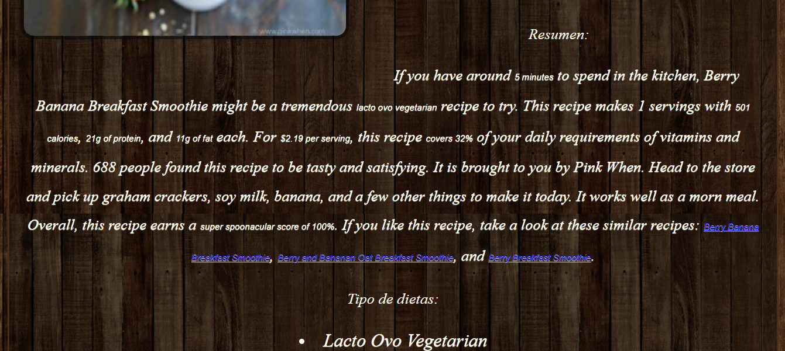
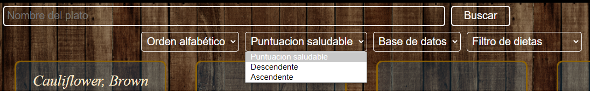

<h1 align="center">Hello, welcome to my GitHub</h1>


<h3 align="center">I am 22 years old and curious by nature, passionate about technological development and i decided to dedicate myself to software development.
I am currently trained as a full stack developer with [academic] experience building websites and mobile apps.
I know the importance of group work to carry out a project, i easily adapt to new environments and I enjoy collaborating with colleagues to solve code or personal problems.</h3>

```javascript
const aboutMe = {
   code: [Javascript, Typescript, HTML, CSS, C++],
   technologies: {
      frontEnd: {
         js: ["React", "Redux", "React-Native"],
      },
      backEnd: {
         js: ["Node", "Express"]
      },
      databases: ["MongoDB", "PostgreSQL"],
   },
};
```
- 🌱 I’m currently learning **Next.js, Json**

- 💬 Ask me about **JavaScript, React, React-Native, Redux, HTML, CSS, Node JS, Express, PostgreSQL, TypeScript, Sequelize, Heroku**
<h3 align="left">Languages and Tools:</h3>
<p align="left">  <a href="https://developer.mozilla.org/en-US/docs/Web/JavaScript" target="_blank">  </a> 
<a href="https://www.w3.org/html/" target="_blank">  </a>
<a href="https://www.w3schools.com/css/" target="_blank">  </a> 
<a href="https://reactjs.org/" target="_blank">  </a> 
<a href="https://reactnative.dev/" target="_blank">  </a> 
<a href="https://redux.js.org" target="_blank">  </a>
<a href="https://nodejs.org" target="_blank">  </a>
<a href="https://expressjs.com" target="_blank">  </a> 
<a href="https://git-scm.com/" target="_blank">  </a> 
<a href="https://www.postgresql.org" target="_blank">  </a> 
<a href="https://postman.com" target="_blank">  </a> 
<a href="https://www.typescriptlang.org/" target="_blank">  </a>

<h3 align="left">Connect with me:</h3>
<p align="left">
<a href="https://www.linkedin.com/in/agustin-g%C3%B3mez-a73632209/" target="_blank"></a>
<a href="https://fb.com/bryancamilo.pinedalopera/" target="_blank"></a>
</p>
- 📫 How to reach me **agu.vivacayasta@gmail.com**


<h3 align="left">Solo project:</h3>
<h4 align="left">This project was made with "SQL, REACT, REDUX, SEQUELIZE, EXPRESS and AXIOS":</h4>



<h4 align="left">Recipes can be created:</h4>


<h4 align="left">see in detail:</h4>


<h4 align="left">can be filtered, sorted and searched:</h4>


